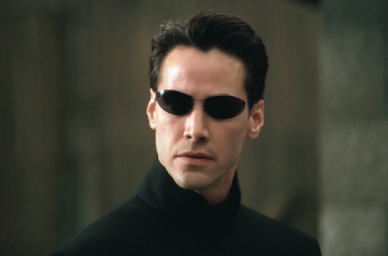

# Image2Shadertoy


**Image2Shadertoy** is a Python script that converts a 2D image into a Shadertoy-compatible GLSL shader using Gaussian splatting. It trains a set of 2D Gaussians to approximate the input image and generates a compact Shadertoy shader that renders the image in real-time on the GPU. The script is optimized for performance and memory efficiency, supporting both small and large Gaussian counts through a hybrid rendering approach (vectorized for small counts, tiled for large counts).

This tool is ideal for artists, developers, and researchers interested in procedural image rendering, shader programming, or Gaussian splatting techniques.

### Example
| Input: `neo.png` | Output: `result.png` |
|------------------|----------------------|
|  |  |

---

## Features

- **Gaussian Splatting**: Represents an image as a collection of 2D Gaussians with RGB colors, positions, scales, anisotropy, and rotations.
- **Shadertoy Output**: Generates optimized GLSL code for Shadertoy, packing Gaussian parameters into `uvec3` arrays for efficient rendering.
- **Hybrid Rendering**: Uses vectorized rendering for small Gaussian counts (<500) and tile-based culling for larger counts to balance speed and memory.
- **Training Pipeline**: Trains Gaussians in multiple stages, adding more Gaussians based on reconstruction error and pruning low-contribution ones.
- **Command-Line Interface**: Flexible inputs for image paths, output files, initial Gaussian count, and iterations.
- **Regularization**: Includes sparsity, sigma, and anisotropy regularization to ensure compact and visually accurate results.

---

## Installation

### Prerequisites
- **Python**: 3.8 or higher
- **PyTorch**: GPU support recommended (CUDA-compatible GPU)
- **Dependencies**: Listed in `requirements.txt`

### Setup
1. **Clone the Repository**:
   ```bash
   git clone https://github.com/yourusername/Image2Shadertoy.git
   cd Image2Shadertoy
   
### Usage
- Run the example command to confirm it works:
```bash
     python Image2Shadertoy.py -i neo.png -n 32
```
- Check that `result.png` and `result.shadertoy` are generated correctly.
- Upload `result.shadertoy` to [Shadertoy](https://www.shadertoy.com/new) to verify it renders `neo.png` accurately.
- Here you can see the example running on a [shadertoy](https://www.shadertoy.com/view/wXBSWD).